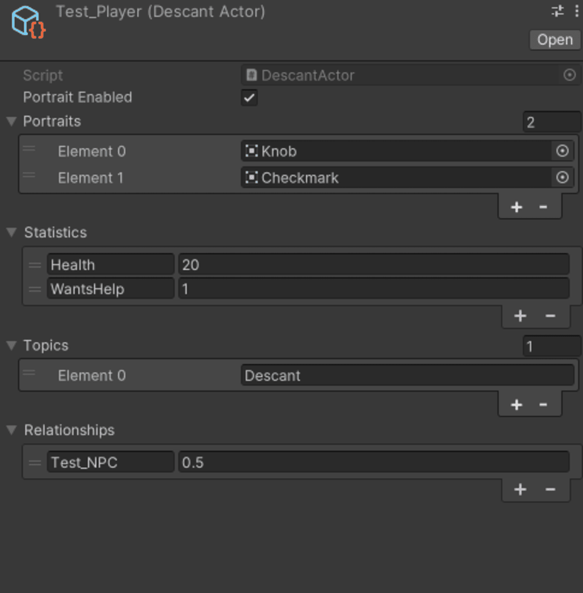

# Descant

*dess • can’t*

> 1. an independent treble melody sung or played above a basic melody.
> 2. a melodious song.
> 3. a discourse on a theme.

  
  

## Overview

**Descant** is a **Unity** dialogue system plugin. The [Unity Asset Store](https://assetstore.unity.com) is [chock full](Documentation/system_review.xlsx) of many such types of plugins, ranging from [feature-rich](https://assetstore.unity.com/packages/tools/behavior-ai/dialogue-system-for-unity-11672), to [ultra-minimalist](https://assetstore.unity.com/packages/tools/visual-scripting/conversa-dialogue-system-192549), to [downright bad](https://assetstore.unity.com/packages/tools/c5-dialogue-system-14881). **Descant** aims to hit the sweet spot between quality UI, powerful features, and easy-to-lean functionality, while also addressing many of the game-specific consequences of the standard dialogue manager setup. Besides acting as a standard tool for creating, saving, and actualizing non-linear game dialogue, it also pushes the envelope by adding optional dialogue-enhancing node components that introduce features to break away from the overused and underwhelming trends seen in many interactive fiction games. These enhancements act similar to **Unity**’s standard `GameObject` `Component` system, and can be applied at-will to nodes. This modular approach is so-far not explored in the world of Unity dialogue systems. The project will be free *(and collaborative open-source)* forever. Feel free to send me a message or submit a pull request if you want to make any changes.

## Installation

1. Install the latest release from the [GitHub repository](https://github.com/Owmacohe/Descant/releases), unzip it, and place the folder into your Unity project's `Packages` folder.
2. Within your Unity project, navigate to the **Package Manager** window.
3. Within the **Package Manager**, click on the **+** icon in the top left, and select **Add package from disk…**
4. Navigate to the zipped **Descant** folder, and within that folder, select `package.json`.
5. A sample scene can be found at: `Descant/Examples/Test_Scene.unity`.
6. Opening this scene may prompt you to install **Text Mesh Pro**. Simple click on **Import TMP Essentials** to do so.

## Descant Files

- **Descant Graphs**
  - **Descant Graphs** can be created by right clicking, and selecting `Create/Descant Graph`.
  - **Descant Graphs** can be edited by right clicking on a `Descant Graph` file, and selecting `Edit Descant Graph`.
- **Descant Actors**
  - **Descant Actors** can be created by right clicking, and selecting `Create/Descant Actor`.
  - **Descant Actors** can be edited by right clicking on a `Descant Actor` file, and selecting `Edit Descant Actor`.
- **Descant Logs** don't need to be crated or modified manually by the player at all. A single `DescantLogData` file exists in the `Descant/Resources` folder. Please don't delete it!

## Usage
- **Descant Graphs**
  1. The **Descant Graph Editor** can be opened with `Tools/Descant/Graph Editor` or by creating/editing a **Descant Graph** file.
  2. Use middle-click to pan around in the editor.
  3. New nodes can be created by right-clicking within the grid.
  4. Connections between nodes can be created by left-clicking on nodes’ ports, and dragging to create a connection line to another port.
  5. `ChoiceNode`s represent player choices at certain moments within the dialogue, and `ResponseNode`s represent the NPC’s responses or statements.
  6. If you want to have a `DescantActor`’s statistic show up within a `ChoiceNode` or `ResponseNode`'s text, write `{actor_name:statistic_name}`, and **Descant** will inject the statistic right into it. *(see the below for more info on `DescantActor`s)*.
  7. The `StartNode` represents the place where a given dialogue begins, and `EndNode`s represent where it can end.
  8. More complex functionality can be added to nodes by adding `Components` (see the [Component documentation](https://omch.tech/descant) for more info on each default component, as well as how to write your own).
- **Descant Actors**
  1. The **Descant Actor Editor** can be opened with `Tools/Descant/Descant Actor Editor` or by creating/editing a **Descant Actor** file.
  2. New **Statistics**, **Topics**, and **Relationships** can be added with their respective **Add** buttons.
     - **Statistics** are variables that pertain to actors *(e.g. health, level, stamina, etc.)*
     - **Topics** are concepts that the actors may learn during dialogue *(e.g. names of characters, locations, events, etc.)*
     - **Relationships** are values quantifiably that represent how actors feel about each other.
  3. The **Dialogue attempts** represents the number of times that this actor has been talked to by the player.
- **Runtime**
  1. Drag the `ConversationUI` prefab from the `Descant/Assets` folder into your Unity scene *(you may have as many `ConversationUI`s as you want in the same scene, and you may modify their text and UI styles as much as you want, so long as the `DescantConversationUI`'s inspector assignments don’t get broken)*.
  2. Add an `Event System` object to your scene *(`Create/UI/Event System`)*, if you don't already have one.
  3. Add a `DescantDialogueTrigger` script to a GameObject of your choice, and assign its fields *(hover over each field to see a popup of its description) (you may have as many `DescantDialogueTrigger`s as you want in the same scene)*.
  4. At some point while the game is running, call the `Display()` method in the `DescantDialogueTrigger` script to begin the dialogue *(e.g. when the player presses `[E]`, when a `Button` is clicked, etc.)*.
- **Logs**
  1. The **Descant Log** can be opened with `Tools/Descant/Log`.
  2. Turn the `Capture` toggle on to start capturing events as they happen at runtime.
  3. The log only saves the last played dialogue.
  4. Please don't delete the log file located at `Descant/Resources`!

## Documentation

- This `README`
- [Component documentation](https://omch.tech/descant)
- Planning
  - [Initial research](Documentation/interaction_research.md), [market survey](Documentation/system_review.xlsx), and [key pitfalls and successes](Documentation/pitfalls_and_sucesses.md)
  - [Features list](Documentation/features.md)
  - [Weekly process journal](Documentation/journal.md)
- [Unity Asset Store page](https://assetstore.unity.com/packages/slug/273262)

## Inspiration/Sources

- [BlabScript](https://www.lablablab.net/?p=701)
- [Ultima Ratio Regum](https://www.markrjohnsongames.com/games/ultima-ratio-regum)
- [Emily Short's Interactive Storytelling](https://emshort.blog/how-to-play/writing-if/my-articles/conversation)
- [A Gossip Virtual Social Network for Non Playable Characters in Role Play Games](https://ieeexplore.ieee.org/document/6680108?part=1)
- [NiEngine](https://github.com/StephanieRct/NiEngine)
